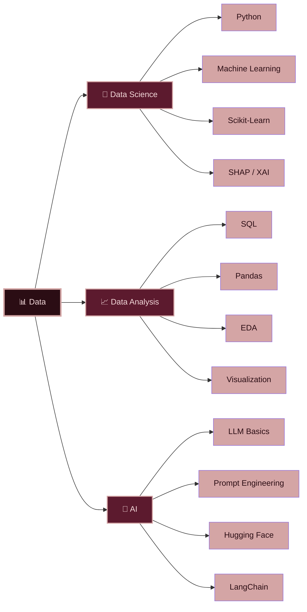

<h1 align="center">
  
</h1>

<div align="center">
  
</div>

<p align="center">
  
  
  
  
</p>

<p align="center">
  <a href="#-about-me">About</a> •
  <a href="#-tech-arsenal">Tech Stack</a> •
  <a href="#-current-focus">Current Focus</a> •
  <a href="#-featured-projects">Projects</a> •
  <a href="#-github-statistics">Stats</a> •
  <a href="#-lets-connect">Contact</a>
</p>

---

## 🚀 About Me


```python
class DataScientist:
    def __init__(self):
        self.name = "Sharanya Thirumoorthi"
        self.role = "AI & Data Science Graduate"
        self.specialization = "Data Science & Machine Learning"
        self.current_focus = [
            "Data Analytics",
            "Machine Learning",
            "Explainable AI",
            "LLM Fundamentals",
            "Prompt Engineering",
        ]
        self.learning = [
            "FastAPI",
            "PostgreSQL",
            "Generative AI",
        ]
        self.interests = [
            "Exploratory Data Analysis",
            "Predictive Modeling",
            "Time Series Forecasting",
            "AI Applications",
        ]

    def say_hi(self):
        print("Let's turn data into something meaningful!")


me = DataScientist()
me.say_hi()
````

<br clear="right"/>

---

## Tech Arsenal

**Programming Languages**

<table align="center"><tr>
<td align="center">
<br/>
<sub><b>Python</b></sub><br/>
<sub><code>█████████░</code> Strong</sub>
</td>
<td align="center">
<br/>
<sub><b>Java</b></sub><br/>
<sub><code>███████░░░</code> Proficient</sub>
</td>
<td align="center">
<br/>
<sub><b>SQL</b></sub><br/>
<sub><code>████████░░</code> Strong</sub>
</td>
</tr></table>

<br/>

**Data Science & Machine Learning**

<table align="center"><tr>
<td align="center">
<br/>
<sub><b>Pandas</b></sub><br/>
<sub><code>█████████░</code> Strong</sub>
</td>
<td align="center">
<br/>
<sub><b>NumPy</b></sub><br/>
<sub><code>████████░░</code> Strong</sub>
</td>
<td align="center">
<br/>
<sub><b>Scikit-Learn</b></sub><br/>
<sub><code>████████░░</code> Strong</sub>
</td>
<td align="center">
<br/>
<sub><b>SHAP / XAI</b></sub><br/>
<sub><code>███████░░░</code> Proficient</sub>
</td>
</tr></table>

<br/>

**Data Analytics & Visualization**

<table align="center"><tr>
<td align="center">
<br/>
<sub><b>Matplotlib</b></sub><br/>
<sub><code>████████░░</code> Strong</sub>
</td>
<td align="center">
<br/>
<sub><b>Seaborn</b></sub><br/>
<sub><code>███████░░░</code> Proficient</sub>
</td>
<td align="center">
<br/>
<sub><b>Plotly</b></sub><br/>
<sub><code>███████░░░</code> Proficient</sub>
</td>
<td align="center">
<br/>
<sub><b>Excel</b></sub><br/>
<sub><code>██████░░░░</code> Familiar</sub>
</td>
<td align="center">
<br/>
<sub><b>Jupyter</b></sub><br/>
<sub><code>█████████░</code> Strong</sub>
</td>
</tr></table>

<br/>

**Generative AI**

<table align="center"><tr>
<td align="center">
<br/>
<sub><b>LLM Basics</b></sub><br/>
<sub><code>██████░░░░</code> Learning</sub>
</td>
<td align="center">
<br/>
<sub><b>Prompt Engineering</b></sub><br/>
<sub><code>███████░░░</code> Proficient</sub>
</td>
<td align="center">
<br/>
<sub><b>Hugging Face</b></sub><br/>
<sub><code>██████░░░░</code> Learning</sub>
</td>
<td align="center">
<br/>
<sub><b>LangChain</b></sub><br/>
<sub><code>██████░░░░</code> Learning</sub>
</td>
<td align="center">
<br/>
<sub><b>Generative AI</b></sub><br/>
<sub><code>██████░░░░</code> Learning</sub>
</td>
</tr></table>

<br/>

**Backend & APIs**

<table align="center"><tr>
<td align="center">
<br/>
<sub><b>FastAPI</b></sub><br/>
<sub><code>███████░░░</code> Proficient</sub>
</td>
</tr></table>

<br/>

**Databases**

<table align="center"><tr>
<td align="center">
<br/>
<sub><b>PostgreSQL</b></sub><br/>
<sub><code>██████░░░░</code> Learning</sub>
</td>
<td align="center">
<br/>
<sub><b>MySQL</b></sub><br/>
<sub><code>███████░░░</code> Proficient</sub>
</td>
</tr></table>

<br/>

**Tools & Platforms**

<table align="center"><tr>
<td align="center">
<br/>
<sub><b>Git</b></sub><br/>
<sub><code>████████░░</code> Strong</sub>
</td>
<td align="center">
<br/>
<sub><b>GitHub</b></sub><br/>
<sub><code>████████░░</code> Strong</sub>
</td>
<td align="center">
<br/>
<sub><b>VS Code</b></sub><br/>
<sub><code>████████░░</code> Strong</sub>
</td>
<td align="center">
<br/>
<sub><b>Google Colab</b></sub><br/>
<sub><code>████████░░</code> Strong</sub>
</td>
</tr></table>

<br/>


<br/>


---

## 🎯 What I'm Exploring


---

## 🚀 Featured Projects

| Project                                                                                                                                  | Description                                                                                             | Tech Stack                                              |
| :--------------------------------------------------------------------------------------------------------------------------------------- | :------------------------------------------------------------------------------------------------------ | :------------------------------------------------------ |
| 🌊 **[Flood Probability Prediction](https://github.com/tsharanya2005/Flood-Probability-Prediction-)**                                    | Random Forest model for flood probability prediction with explainable AI to understand model decisions. | `Python` `Pandas` `Scikit-learn` `Random Forest` `SHAP` |
| 🌾 **[Agri-Horticulture Commodities Price Prediction](https://github.com/tsharanya2005/Agri-Horticulture-Commodities-Price-Prediction)** | Time-series based analysis and forecasting of agricultural commodity prices and trends.                 | `Python` `Pandas` `Time Series` `Forecasting`           |
| 🎙️ **[Voice Coding Assistant](https://github.com/tsharanya2005/voice-coding-assistant)**                                                | Voice-driven Python learning assistant designed to make coding more accessible.                         | `Python` `AI` `Voice Interaction`                       |
| 🏅 **[Olympic 2024 Analysis](https://github.com/tsharanya2005/Olympic_2024_Analysis)**                                                   | Exploratory analysis of Paris 2024 Olympic data to uncover medal and performance trends.                | `Python` `Pandas` `EDA` `Matplotlib` `Seaborn`          |
| 🚲 **[Bike Purchase Dashboard](https://github.com/tsharanya2005/Bike_purchase_dashboard)**                                               | Interactive dashboard analysing customer demographics and purchasing behaviour.                         | `Power BI` `Excel` `Data Analytics`                     |
| 🌍 **[Forbes Global 2000](https://github.com/tsharanya2005/Forbes--The-Global-2000-)**                                                   | Analysis of revenue, profit and market trends across major global companies.                            | `Python` `Pandas` `EDA` `Visualization`                 |

<p align="center">
  <a href="https://github.com/tsharanya2005?tab=repositories">
    
  </a>
</p>

---

## 📊 GitHub Statistics

<div align="center">


</div>

<div align="center">


</div>

<div align="center">


</div>

---


## 🧩 LeetCode

<div align="center">


</div>

---

## 🐍 Contribution Snake

<div align="center">


</div>

---

## 🎓 Learning & Credentials

<div align="center">

<p>
  
  
  
</p>

<p>
  
  
  
</p>

</div>


---

## 🌐 Let's Connect

<div align="center">

<a href="mailto:sha2005ranya@gmail.com">

</a>

<a href="https://www.linkedin.com/in/sharanya-thirumoorthi-6a47a8258/">

</a>

<a href="https://github.com/tsharanya2005">

</a>

<a href="https://leetcode.com/u/Sharanya01/">

</a>

<a href="https://www.kaggle.com/sharanyathirumoorthi">

</a>

<br><br>


</div>

---

<div align="center">


</div>

<div align="center">


</div>

<div align="center">

<sub>⭐ From <a href="https://github.com/tsharanya2005">Sharanya Thirumoorthi</a> with 🤍</sub>

</div>

